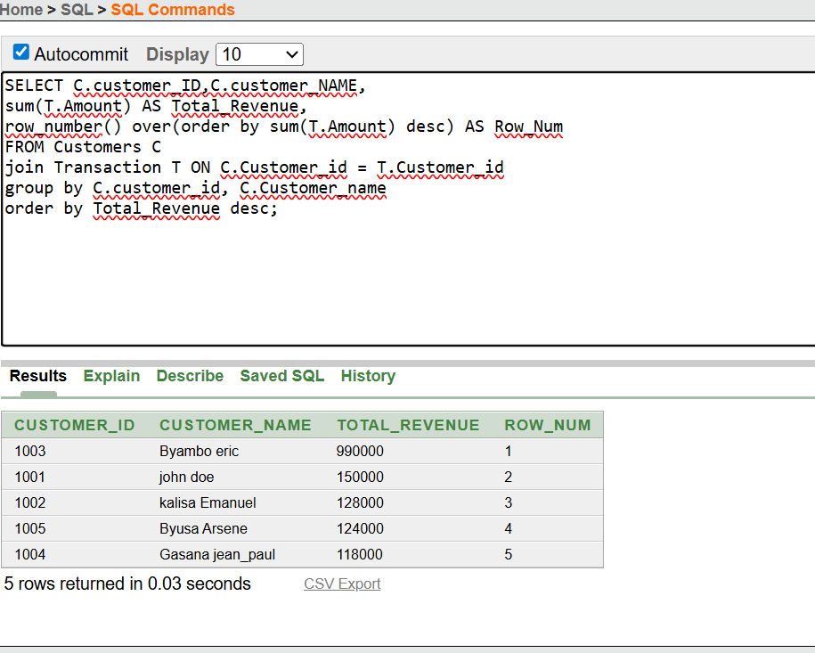

# **Window Function Implementation**
## **Ranking**
### *1.Row_Number()*
This query calculates the total revenue per customer by joining the customers table and the transaction tables. This query groups the data by Customer_id and customer_name to aggregate the amount from transaction. Row_number() assigns a unique sequential number to each customer based on there total revenue in descending order, helping identify the top customers with a high spending, thus offering them special offers.
 
 ***query***

SELECT C.customer_ID,C.customer_NAME,
sum(T.Amount) AS Total_Revenue,
row_number() over(order by sum(T.Amount) desc) AS Row_Num
FROM Customers C
join Transaction T ON C.Customer_id = T.Customer_id
group by C.customer_id, C.Customer_name
order by Total_Revenue desc;

***output***

### *2.Rank()*
This query calculates the total revenue per customer by joining the customers table and the transaction table. This query groups the data by customer_id and customer_name then aggregate the amount from transactions. Rank() assigns a rank to each customer based on total revenue in descending order, with ties receiving the same rank. The result helps identify top customers that spend a lot and therefore being able to provide special offers.

***query***

SELECT C.customer_id,C.customer_name,
sum(T.amount) as Total_revenue,
rank() over (order by sum(T.amount) desc)as rank_value
FROM customers C 
join transaction T on C.customer_id = T.customer_id
group by C.customer_id, C.customer_name
order by total_revenue desc;

***output***

.png)

### *3.Dense_Rank()*
This query calculates the total revenue per customer by joining the customers table and transaction tables. It groups the data by customer_id and customer_name to aggregate the amount from the transaction table. Dense_Rank() assigns a rank to each customer based on there total revenue in descending order, in case of a tie customers receives the same rank and no gaps in the sequence. The result supports identifying top customers for targeted marketing, as outlined in the business problem.

***query***

SELECT C.customer_id,C.customer_name,
sum(T.amount)as total_revenue,
dense_rank() OVER (order by sum(T.amount) desc)as D_rank_value
from customers C
join transaction T on C.customer_id = T.customer_id
group by C.customer_id, C.customer_name
order by total_revenue desc;

***0utput***

.png)

### *4.Percent_Rank()*
This query calculates the total revenue per customer by joining the customers table and transaction table. The query groups the data by customer_id and customer_name and then calculate the aggregate of the amount from transaction. Percent_Rank() computes the relative rank of each customer within the revenue distribution (0 to 1), supporting customer segmentation for marketing as per the business problem. The programming language i used to create this database known as oracle, when you use Percent_Rank() it returns decimals between 0 and 1,but i used to_char with fm0.99 to be able to display the result to 2decimal places.

***query***

select C.customer_id,C.customer_name,
sum(T.amount) as total_revenue,
to_char(percent_rank() over (order by sum(T.amount)desc), 'FM0.99') || '%' as P_rank_value 
from customers C
join transaction T ON C.customer_id = T.customer_id
group by C.customer_id,C.customer_name
order by total_revenue desc;

.png)

## **Aggregate**
### *1.Sum()*
This query adds up all sales from each month and show how sales are standing so far at the end of every month. The query rounds up all the sales per month and uses a simple way to calculate it using a window funtion sum() and then add all sales up to each month. This will help in controlling sales growth for marketing and productivity purposes.

***query***

select to_char(to_date(sale_date, 'yyyy-mm-dd'), 'yyyy-mm') as month,
sum(amount) as monthly_total,
sum(sum(amount)) over (order by to_char(to_date(sale_date, 'yyyy-mm-dd'), 'yyyy-mm')) as running_total
from transaction
group by to_char(to_date(sale_date, 'yyyy-mm-dd'), 'yyyy-mm')
order by month;

***output***

.png)

### *2.AVG()*
This query finds the average of sales per month so far and shows it, and then groups all the sales per month from the transaction table. These sales will be used to calculate the average of sales up to each month using a very simple window function known as sum(). This will help in controlling the growth of sales thus plannning ahead of the market.

***queries***

select to_char(to_date(sale_date, 'yyyy-mm-dd'), 'yyyy-mm') as month,
round(avg(amount), 2) as monthly_avg,
round(avg(avg(amount)) over (order by to_char(to_date(sale_date, 'yyyy-mm-dd'), 'yyyy-mm')), 2) as running_avg
from transaction
group by to_char(to_date(sale_date, 'yyyy-mm-dd'), 'yyyy-mm')
order by month;

***output***

.png)

### *3.MIN()*
This query will first find the lowest sales per month and also tracks the lowest sales overall so far and then after that it will group up all the sales from the transaction table per month and then apply a simple window function called min() that will find the lowest running amount up to each month.

***queries***

select to_char(to_date(sale_date, 'yyyy-mm-dd'), 'yyyy-mm') as month,
min(amount) as monthly_min,
min(min(amount)) over (order by to_char(to_date(sale_date, 'yyyy-mm-dd'), 'yyyy-mm')) as running_min
from transaction
group by to_char(to_date(sale_date, 'yyyy-mm-dd'), 'yyyy-mm')
order by month;

***output***

### *4.MAX()*
This query wil track the highest sale per month and then track the highest sale overall so far. The query will group them per month and use a window function known as max() to calculate the highest running amount up to each month.

***queries***

***output***

## **Navigation**
### *1.Lag()*
This query shows the total sales of this month and the month before, after rounding up all the sales together the query uses a window function known as lag() for comparision. This can be used to improve sales and for marketing purposes

***queries***

select to_char(to_date(sale_date, 'yyyy-mm-dd'), 'yyyy-mm') as month,
round(sum(amount), 2) as monthly_total,
round(lag(sum(amount)) over(order by to_char(to_date(sale_date, 'yyyy-mm-dd'), 'yyyy-mm')), 2) 
as previous_month_total
from transaction
group by to_char(to_date(sale_date, 'yyyy-mm-dd'), 'yyyy-mm')
order by month;

***output***

### *2.LEAD()*
This query shows the monthly sales and monthly sales of the next month. This query rounda up all sales per month and uses a window function Lead() to calculate a prediction for the next month sales.This can help in predicting the market change and for making an appropriate buisiness plan.

***queries***

select to_char(to_date(sale_date, 'yyyy-mm-dd'), 'yyyy-mm') as month,
round(sum(amount), 2) as monthly_total,
round(lead(sum(amount)) over (order by to_char(to_date(sale_date, 'yyyy-mm-dd'), 'yyyy-mm')), 2) as next_month_total
from transaction
group by to_char(to_date(sale_date, 'yyyy-mm-dd'), 'yyyy-mm')
order by month;

***output***

## **Distribution*
### *1.Nile(4)*
This query joins customers table and transaction table and then joins customers with there total spending and split them into 4 groups. The query uses a window function known as NTILE() to group them into 4 segment based on how much they have spend. This will help in knowing which customer is to be rewarded with the special offer.

***queries***

select c.customer_id,c.customer_name,
round(sum(t.amount), 2) as total_spent,
ntile(4) over (order by sum(t.amount) desc) as customer_segment
from customers c
join transaction t on c.customer_id = t.customer_id
group by c.customer_id, c.customer_name
order by total_spent desc;

***output***

### *2.CUME_DIST()*
