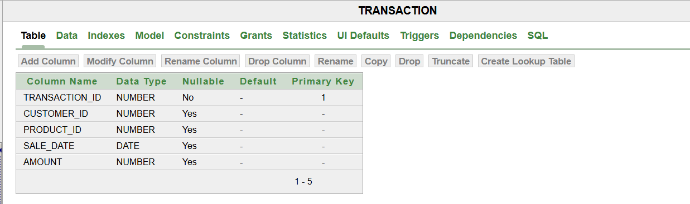
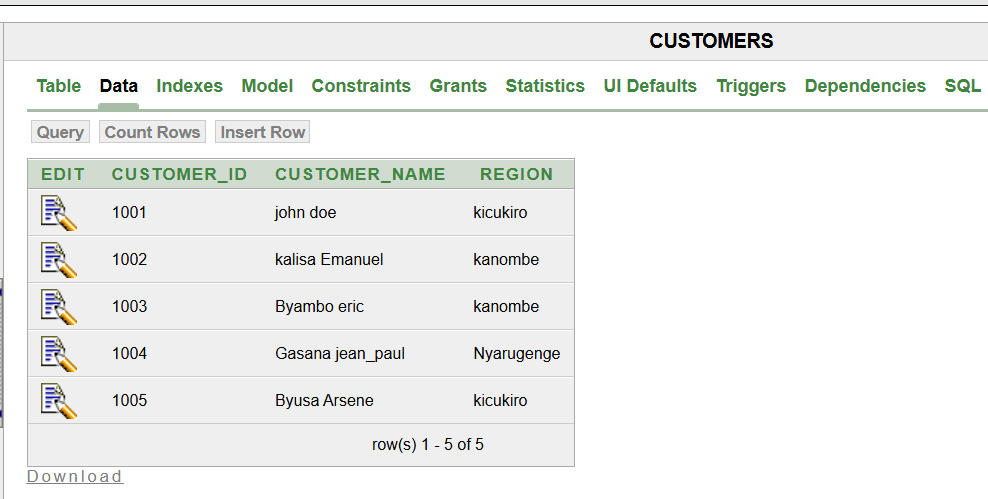
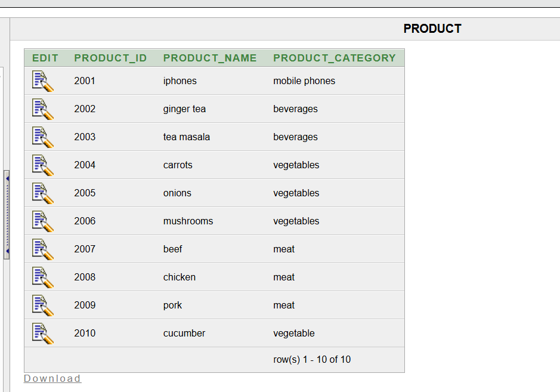
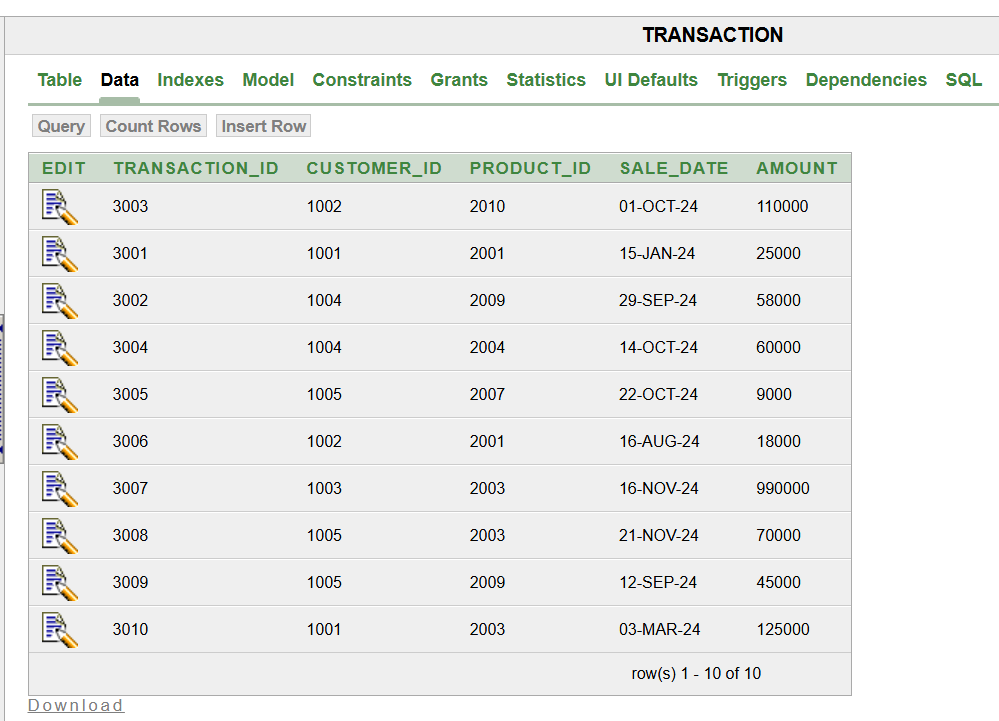

# **Database Schema**
## **Tables Design**
### *Customers table* 
This customers table will provide an id for each customer and and show there name and the region they are coming from, this will help in knowing where to find customers who spend more and which region gets more deliveries and which region gets less thus improving our deliveries.

### *products table*
this table will help in tracking the products inventories and knowing which products is leaving the stock as well as the product category.

### *Transaction table*
this table will will show the transactions that was done by every customer, thus tracking the amount of income the buisiness receives per mounth and tracking the amount of products that leaves the stock and tracking the customer who spent more.

## **Data entry**
### *Customers table*
These are some of the customers that were entered in the database with the region in which they come from, each customer is also assigned an id so as  to avoid data duplication.

### *Products table*
These are all the products that are in stock at the moment in the buisiness and they are all assigned an id so that they can be identified individually and this reduces the data duplication.

### *Transaction table*
This table shows how each transaction that was performed is linked to every customer and product and each transaction is also assigned a specific id to avoid duplication, and each transaction has a date and amount.

## **ER Diagram**
This diagram will illustrate clearly what is the relationship between table and how exactly the cardinality between entities and also will show the foreign key as well as primary key from each table.

.png)
