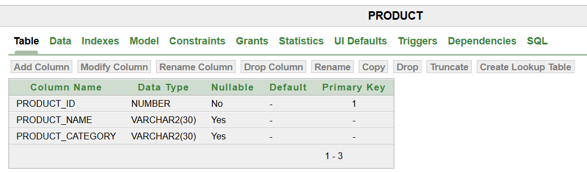

# **Database Schema**
## **Tables Design**
### *Customers table* 
This customers table will provide an id for each customer and and show there name and the region they are coming from, this will help in knowing where to find customers who spend more and which region gets more deliveries and which region gets less thus improving our deliveries.

### *products table*
this table will help in tracking the products inventories and knowing which products is leaving the stock as well as the product category.

